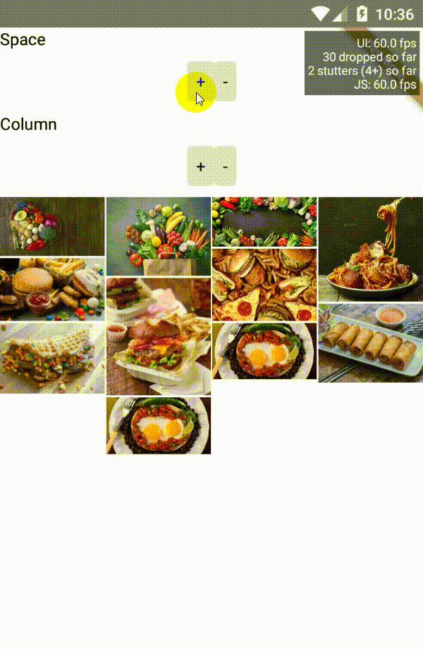

<div align="center">
<h1>React Native Masonry</h1>

</div>

`rn-masonry` is built with the following features and functionalities baked in 🍰:
- Dynamic Column Rendering
- Device Rotation
- On-press Handlers
- Custom Headers & Captions
- Optimized to Rendering Large List
- Automatic Sizing Based on Available Space

## Table of Contents

1. [Installation](#installation)
2. [Usage](#usage)
3. [Props](#props)
4. [Credits](#built-with)
5. [License](#license)

## installation
    ```sh
    $ npm install --save rn-masonry
    ```
    or
    ```bash
    $ yarn add rn-masonry
    ```
## Usage

    ```js
    import Masonry from 'rn-masonry';
    ```
    ```js
    <Masonry
      columns={4} // optional - Default: 2
      data={[
        { uri: 'http://image1.jpg' },
        { uri: 'http://image2.jpg' },
        { uri: 'http://image3.jpg' }
      ]}
    />
    ```

## Props

|       name            | required |     type     |        default        |            description                                                                                        |
| --------------------- | -------- | -------------|---------------------- | --------------------------------------------------------------------------------------------------------------|
|   data                |  YES     |   `DataType` |                       | List data for masonry. Check `DataType` interface                                                             |
|   columns             |  NO      |   number     |            2          | Desired number of columns                                                                                     |
|   space               |  NO      |   number     |            2          | Spacing each column                                                                                           |
|   onEndReach          |  NO      |   function   |        undefined      | Called once when the scroll position gets within onEndReachedThreshold of the rendered content.               |
|   canRefresh          |  NO      |   bool       |        false          | Enable/Disable `RefreshControl`.                                                                              |
|   onRefresh           |  NO      |   function   |        undefined      | Called when the view starts refreshing.                                                                       |
|   refreshing          |  NO      |   function   |        undefined      | Whether the view should be indicating an active refresh.                                                      |
|   refreshColor        |  NO      |   function   |        undefined      | The colors (at least one) that will be used to draw the refresh indicator.                                    |
|   customRenderItem    |  NO      |   function   |        undefined      | Function return `React.Element` with param `DataPassPram`.                                                    |
|   onPress             |  NO      |   function   |        undefined      | Function when you press an image. Param:   `DataPassPram`.                                                    |
|   renderHeader        |  NO      |   function   |        undefined      | Function return `React.Element` with param `DataPassPram` to render Header Image.                             |
|   renderFooter        |  NO      |   function   |        undefined      | Function return `React.Element` with param `DataPassPram` to render Footer Image.                             |
|   containerImageStyle |  NO      |   function   |        undefined      | Style for image.                                                 |

### DataType
|       name         | required |     Type     |        default        |            description                                                                                        |
| ------------------ | -------- | ------------ | --------------------- | ------------------------------------------------------------------------------------------------------------- |
|   uri              |  YES     |   string     |                       | The uri of the image location.                                                                                |
|   data             |  No      |   object     |                       | Special data if you want to pass when press, render, render Header, render Footer.                           |

### DataPassPram
|       name         |    Type     |            description                                                                                        |
| ------------------ | ----------- | --------------------------------------------------------------------------------------------------------------|
|   uri              |  string     | The uri of the image location.                                                                                |
|   data             |  object     | Special data if you want to pass when press, render, render Header, render Footer.                            |
|   actualSize       | `Dimensions`| Size image get from remote.                                                                                   |
|   column           |  number     | Current column of image.                                                                                      |
|   width            |  number     | Width image after handle.                                                                                     |
|   height           |  number     | Height image after handle.                                                                                    |

### Dimensions
|       name         |    Type     |            description                                                                                        |
| ------------------ | ----------- | --------------------------------------------------------------------------------------------------------------|
|   width            |  number     | Width of image.                                                                                               |
|   height           |  number     | Height of image.                                                                                              |

## Built With

- [react-native-fast-image](https://github.com/DylanVann/react-native-fast-image)
- [react-fast-compare](https://github.com/FormidableLabs/react-fast-compare)


## License

MIT